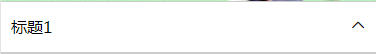
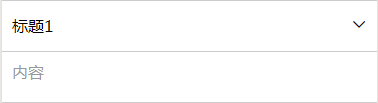

# 介绍
> 折叠面板

## 预览
>组件效果

>展示效果


## 引用
```json
"usingComponents": {
  "em-collapse": "path/to/blocks/Collapse/index"
}
```

## 案例

基本使用方法
```html
<yz-collapse title="标题1"> 内容 </yz-collapse>
```

## 属性

| 属性 | 说明 | 类型 | 默认值 |
| --- | --- | --- | --- |
| title | 标题 | string | null |


## 事件

|事件名	| 说明 | 参数|
| --- | --- | --- |
|暂无	|  | |
